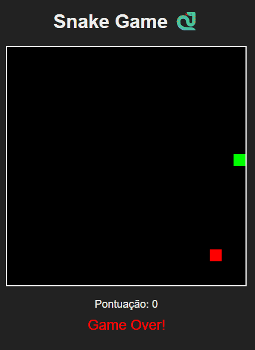

# 🐍 Snake Game


🔗 **Demo online (GitHub Pages):**  
https://devCarlosHenSil.github.io/snake-game/

---

## 🎥 Demonstração



---

Projeto clássico do jogo **Snake**, desenvolvido com **HTML5, CSS3 e JavaScript puro**, com foco em **lógica de programação**, **manipulação do DOM** e **controle de estado do jogo**.

---

## 📌 Objetivo do Projeto

Este projeto foi desenvolvido para praticar e consolidar fundamentos essenciais de front-end:

- Lógica de programação aplicada a jogos simples  
- Manipulação direta do DOM  
- Controle de eventos de teclado  
- Estruturação de código JavaScript  
- Organização básica de um **game loop**  

---

## 🛠️ Tecnologias Utilizadas

- HTML5  
- CSS3  
- JavaScript (Vanilla JS)

---

## 🎮 Funcionalidades

- Controle da cobra via teclado  
- Crescimento da cobra ao consumir o alimento  
- Sistema de pontuação em tempo real  
- Detecção de colisão com paredes e com o próprio corpo  
- Exibição do estado **Game Over** ao perder  

---

## ▶️ Como Executar o Projeto Localmente

1. Clone este repositório:
```bash
git clone https://github.com/devCarlosHenSil/snake-game.git
```

2. Acesse a pasta do projeto:
```bash
cd snake-game
```

3. Abra o arquivo `index.html` em um navegador moderno.

---

## 📂 Estrutura do Projeto

```text
snake-game/
 ├─ index.html
 ├─ css/
 │   └─ style.css
 ├─ js/
 │   └─ game.js
 └─ assets/
     └─ demo.gif
```

---

## 📚 O que aprendi com este projeto

- Organização da lógica de um jogo simples em JavaScript  
- Uso de eventos para interação com o usuário  
- Controle de estados (movimento, pontuação e colisões)  
- Atualização dinâmica da interface via DOM  
- Desenvolvimento de aplicações sem dependências externas  

---

## 🚀 Próximas melhorias

As melhorias abaixo **não estão implementadas atualmente**, mas podem ser exploradas futuramente:

- Persistência de pontuação utilizando `localStorage`  
- Implementação de níveis de dificuldade  
- Suporte a dispositivos móveis (controles por toque)  
- Inclusão de efeitos sonoros e visuais  

---

## 👨‍💻 Autor

Carlos Henrique Silva  
🔗 GitHub: https://github.com/devCarlosHenSil
